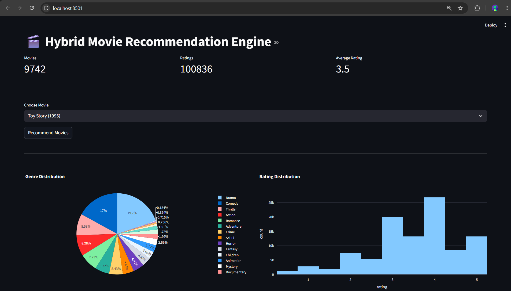
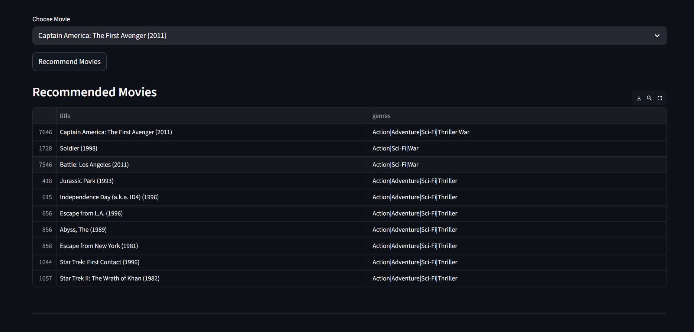

# 🎬 Movie Recommendation Engine Using Machine Learning

## 📌 Project Status

✅ Completed and Functional

🎓 Developed as a Minor Project for B.Tech Computer Science and Engineering

---

# 📖 Project Overview

The Movie Recommendation Engine is a machine learning-based application developed to provide personalized movie recommendations to users. The system analyzes movie genres and user preferences to suggest relevant movies based on similarity. It utilizes Content-Based Filtering techniques along with TF-IDF Vectorization and Cosine Similarity to generate accurate recommendations.

The project uses the MovieLens dataset and provides an interactive dashboard built using Streamlit. Users can select a movie and receive recommendations instantly. The dashboard also provides visual insights into movie genres and rating distributions.

This project demonstrates the practical application of machine learning algorithms in recommendation systems, similar to those used by streaming platforms such as Netflix, Amazon Prime Video, and Disney+.

---

# 🎯 Objectives

* Develop an intelligent movie recommendation system.
* Apply machine learning techniques to real-world datasets.
* Implement a content-based recommendation algorithm.
* Analyze movie data and user rating information.
* Create an interactive dashboard for recommendations and visualizations.
* Gain practical experience in data preprocessing, machine learning, and data analytics.

---

# 🚀 Features

* Movie recommendation based on user-selected movies.
* Content-Based Filtering using TF-IDF Vectorization.
* Similarity calculation using Cosine Similarity.
* Interactive Streamlit dashboard.
* Genre distribution analysis.
* Rating distribution visualization.
* Dataset statistics and insights.
* User-friendly interface.

---

# 🛠️ Technologies Used

## Programming Language

* Python

## Libraries and Frameworks

* Streamlit
* Pandas
* NumPy
* Plotly
* Scikit-Learn
* Matplotlib

## Dataset

* MovieLens Dataset

## Machine Learning Techniques

* Content-Based Filtering
* TF-IDF Vectorization
* Cosine Similarity

---

# 📋 Requirements

Install the following dependencies:

```text
streamlit
pandas
numpy
plotly
scikit-learn
scikit-surprise
requests
```

Or install using:

```bash
pip install -r requirements.txt
```

---

# 📂 Project Structure

```text
Movie-Recommendation-System/
│
├── dataset/
│   ├── movies.csv
│   └── ratings.csv
│
├── models/
│   ├── content_based.py
│   ├── collaborative.py
│   └── hybrid.py
│
├── dashboard/
│   ├── analytics.py
│   └── charts.py
│
├── app.py
├── requirements.txt
├── README.md
└── .gitignore
```

---

# ⚙️ Installation Guide

## Step 1: Clone the Repository

```bash
git clone https://github.com/sagar0149/Movie-Recommendation-System.git
```

## Step 2: Navigate to the Project Folder

```bash
cd Movie-Recommendation-System
```

## Step 3: Install Required Dependencies

```bash
pip install -r requirements.txt
```

## Step 4: Run the Application

```bash
streamlit run app.py
```

---

# 📊 Dataset Information

This project uses the MovieLens Dataset, which contains:

* Movie IDs
* Movie Titles
* Genres
* User IDs
* Movie Ratings

The MovieLens dataset is widely used in recommendation system research and machine learning applications.

---

# 🧠 Working Methodology

## 1. Data Collection

Movie and rating data are collected from the MovieLens dataset.

## 2. Data Preprocessing

* Handling missing values.
* Cleaning genre information.
* Preparing data for machine learning algorithms.

## 3. Feature Extraction

Movie genres are transformed into numerical representations using TF-IDF Vectorization.

## 4. Similarity Calculation

Cosine Similarity is used to determine the similarity between movies.

## 5. Recommendation Generation

Movies with the highest similarity scores are recommended to users based on their selected movie.

## 6. Dashboard Visualization

Interactive charts and statistics are displayed to provide insights into movie genres and ratings.

---

# 📈 Dashboard Analytics

The dashboard provides:

* Total Movies Available
* Total Ratings Collected
* Average Rating
* Genre Distribution
* Rating Distribution
* Most Popular Genres
* Dataset Insights

---

# 📸 Screenshots

### Home Dashboard



### Recommendation Results



---

# 🎓 Learning Outcomes

Through this project, the following concepts were explored:

* Data Cleaning and Preprocessing
* Machine Learning Fundamentals
* Recommendation Systems
* Data Visualization
* Dashboard Development
* Python Programming
* Real-world Dataset Analysis

---

# 📋 Results

The system successfully recommends movies based on similarity between movie genres and user-selected preferences. The recommendation engine demonstrates the effectiveness of machine learning techniques in generating relevant movie suggestions and improving user experience.

---

# 🔮 Future Scope

* Integration of TMDB API for movie posters.
* User authentication system.
* Personalized watchlists.
* Sentiment analysis on movie reviews.
* Cloud deployment.
* Hybrid recommendation models.
* Deep learning-based recommendation systems.
* Mobile application integration.

---

# 👨‍💻 Author

**Sagar Raj Sharma**

**GitHub:** https://github.com/sagar0149

---